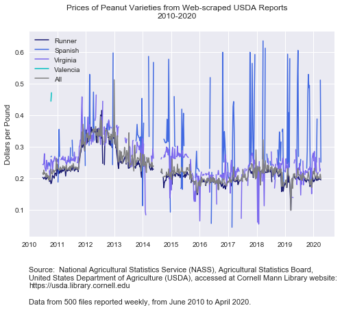

# usda-esmis-parsing
Python tools for interacting with and analyzing reports from the USDA ESMIS (Economics, Statistics and Market Information System)

# Description
"The USDA Economics, Statistics and Market Information System (ESMIS) contains over 2,100 publications from five agencies of the U.S. Department of Agriculture (USDA). These materials cover U.S. and international agriculture and related topics. Mann Library at Cornell University developed and maintains this site." (https://usda.library.cornell.edu/?locale=en)

The USDA ESMIS reports offer a free and open source for agriculture professionals and researchers.  For many reports, multiple file types are available for download in txt, pdf, or zip file formats.  The site also has an API for downloading information.  The tools posted here will use both the file types directly downloaded and the results from querying the API.

# Code files:
**01_scrape_reports.py**: Uses bs4 library to pull links to all reports for a specific crop publication, with weekly peanut price reports as a sample. 
 **02_usda_api_queries.py**: Demonstrates different ways to interact with USDA ESMIS API directly from Python, such as searching all publications based on certain criteria and downloading links to all reports.
 **03_parse_price_reports.py**: More in-depth txt file parsing for a specific publication, using weekly peanut price reports as a sample. Builds price series demonstrated below.

# Sample export:

